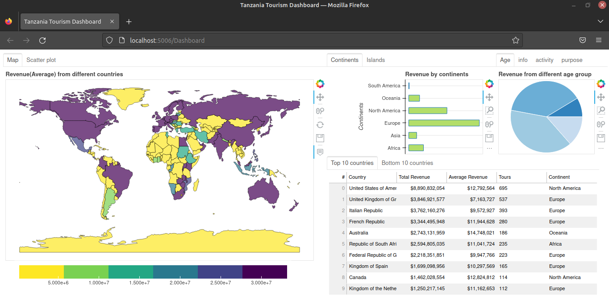

# Tanzania Tourism Prediction by Pycon Tanzania Community

This Project was an online competition conducted on the zindi website. The challenge was to build a Tour Expenditure predictive model using Machine Learning techniques.

### Aim of the Project : 

The model can be used by different tour operators and the Tanzania Tourism Board to automatically help tourists across the world estimate their expenditure before visiting Tanzania.

#### Author : Praveen Shekar

#### Language : Python 3.6

#### Link : https://zindi.africa/competitions/tanzania-tourism-prediction

#### About the dataset :

##### Train set - 4809 x  23

Columns -

- ID (Tour ID)
- country (Home country of the tourist)
- Age group 
- Travel with (Tour Companions)
- Total Female (Number of Female tourists)
- Total Male (Number of Male Tourists)
- Main Activity
- Info Source (Source of Information for the tour)
- Tour Arrangement
- Package transport int (International Transport Package | Product)
- Package accomodation (Accomodation Package | Product)
- Package food (Food Package | Product)
- Package transport tz (Tanzania Transport Package | Product)
- Package sightseeing (Sightseeing Package | Product)
- Package guided tour (Guided tour Package | Product)
- Package insurance (Insurance Package | Product)
- Night Mainland (Total stay period in Mainland)
- Night Zanzibar (Total stay period in Zanzibar)
- Payment mode (Mode of Payment for the tour)
- First trip tz (First trip for the tourist)
- Most impressing (Tourist Feedback)
- Total Cost (Expenditure | Target)

##### Test set - 1601 x 22

##### Target - Total Cost

##### Evaluation Metric - Mean Absolute Error

##### Geospatial Analysis (Google Data Studio)- https://datastudio.google.com/s/iG3E8KzRkxY

##### Dashboard - Bokeh Webapp

Dashboard to visualize revenue collected.

